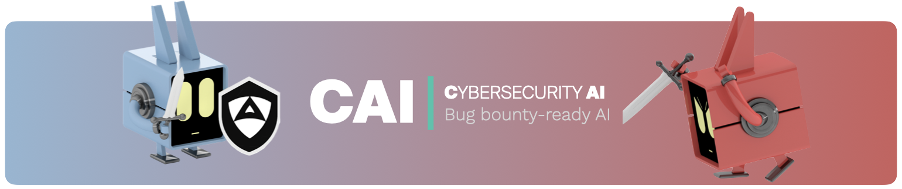

# Cybersecurity AI (`CAI`)

<div align="center">
  <p>
    <a align="center" href="" target="https://supervision.roboflow.com">
      
    </a>
  </p>

[](https://badge.fury.io/py/supervision)
[](https://pypistats.org/packages/supervision)
[](https://github.com/roboflow/supervision/blob/main/LICENSE.md)
[-red.svg)](https://app.hackthebox.com/users/2268644)
[-red.svg)](https://app.hackthebox.com/users/2268644)
[-red.svg)](https://app.hackthebox.com/users/2268644)


</div>

A lightweight, ergonomic framework for building bug bounty-ready Cybersecurity AIs (CAIs).


> [!WARNING]
> :warning: CAI is in active development, so don't expect it to work flawlessly. Instead, contribute by raising an issue or sending an MR.
>
> Access to this library and the use of information, materials (or portions thereof), is **<u>not intended</u>, and is <u>prohibited</u>, where such access or use violates applicable laws or regulations**. By no means the authors encourage or promote the unauthorized tampering with running systems. This can cause serious human harm and material damages.
>
> *By no means the authors of CAI encourage or promote the unauthorized tampering with compute systems. Please don't use the source code in here for cybercrime. <u>Pentest for good instead</u>*.


## :bookmark: Table of Contents

- [Cybersecurity AI (`CAI`)](#cybersecurity-ai-cai)
  - [:bookmark: Table of Contents](#bookmark-table-of-contents)
  - [Motivation](#motivation)
    - [:bust\_in\_silhouette: Why CAI?](#bust_in_silhouette-why-cai)
    - [Ethical principles behind CAI](#ethical-principles-behind-cai)
  - [:nut\_and\_bolt: Install](#nut_and_bolt-install)
  - [:triangular\_ruler: Architecture:](#triangular_ruler-architecture)
    - [Code structure](#code-structure)
    - [Key Concepts](#key-concepts)
      - [🔹 Agent](#-agent)
      - [🔹 Agentic Patterns](#-agentic-patterns)
      - [🔹 How do agents work together? Functions](#-how-do-agents-work-together-functions)
      - [🔹 Interactions and Turns](#-interactions-and-turns)
      - [🔹 Human-In-The-Loop (HITL)](#-human-in-the-loop-hitl)
  - [:rocket: Quickstart](#rocket-quickstart)
    - [Environment Variables](#environment-variables)
  - [Development](#development)
    - [Development Contributions](#development-contributions)
    - [Optional Requirements: caiextensions](#optional-requirements-caiextensions)
    - [Reproduce CI-Setup locally](#reproduce-ci-setup-locally)
  - [FAQ](#faq)
  - [Citation](#citation)
  - [Acknowledgements](#acknowledgements)


## Motivation
### :bust_in_silhouette: Why CAI?
The cybersecurity landscape is undergoing a dramatic transformation as AI becomes increasingly integrated into security operations. **We predict that by 2028, AI-powered security testing tools will outnumber human pentesters**. This shift represents a fundamental change in how we approach cybersecurity challenges. *AI is not just another tool - it's becoming essential for addressing complex security vulnerabilities and staying ahead of sophisticated threats. As organizations face more advanced cyber attacks, AI-enhanced security testing will be crucial for maintaining robust defenses.*

We believe that democratizing access to advanced cybersecurity AI tools is vital for the entire security community. That's why we're releasing Cybersecurity AI (`CAI`) as an open source framework. Our goal is to empower security researchers, ethical hackers, and organizations to build and deploy powerful AI-driven security tools. By making these capabilities openly available, we aim to level the playing field and ensure that cutting-edge security AI technology isn't limited to well-funded private companies or state actors.

Bug Bounty programs have become a cornerstone of modern cybersecurity, providing a crucial mechanism for organizations to identify and fix vulnerabilities in their systems before they can be exploited. These programs have proven highly effective at securing both public and private infrastructure, with researchers discovering critical vulnerabilities that might have otherwise gone unnoticed. CAI is specifically designed to enhance these efforts by providing a lightweight, ergonomic framework for building specialized AI agents that can assist in various aspects of Bug Bounty hunting - from initial reconnaissance to vulnerability validation and reporting. Our framework aims to augment human expertise with AI capabilities, helping researchers work more efficiently and thoroughly in their quest to make digital systems more secure.

### Ethical principles behind CAI

You might be wondering if releasing CAI *in-the-wild* given its capabilities and security implications is ethical. Our decision to open-source this framework is guided by two core ethical principles:

1. **Democratizing Cybersecurity AI**: We believe that advanced cybersecurity AI tools should be accessible to the entire security community, not just well-funded private companies or state actors. By releasing CAI as an open source framework, we aim to empower security researchers, ethical hackers, and organizations to build and deploy powerful AI-driven security tools, leveling the playing field in cybersecurity.

2. **Transparency in AI Security Capabilities**: Based on our research results, understanding of the technology, and dissection of top technical reports, we argue that current LLM vendors are undermining their cybersecurity capabilities. This is extremely dangerous and misleading. By developing CAI openly, we provide a transparent benchmark of what AI systems can actually do in cybersecurity contexts, enabling more informed decisions about security postures.

CAI is built on the following core principles:
- **Cybersecurity oriented AI framework**: CAI is specifically designed for cybersecurity use cases, aiming at semi- and fully-automating offensive and defensive security tasks.
- **Open source, free for research**: CAI is open source and free for research purposes. We aim at democratizing access to AI and Cybersecurity. For professional or commercial use, including on-premise deployments, dedicated technical support and custom extensions [reach out](mailto:research@aliasrobotics.com) to obtain a license.
- **Lightweight**: CAI is designed to be fast, and easy to use.
- **Modular and agent-centric design**: CAI operates on the basis of agents and agentic patterns, which allows flexibility and scalability. You can easily add the most suitable agents and pattern for your cybersecuritytarget case.
- **Tool-integration**: CAI integrates already built-in tools, and allows the user to integrate their own tools with their own logic easily.
- **Logging and tracing integrated**: using [`phoenix`](https://github.com/Arize-ai/phoenix), the open source tracing and logging tool for LLMs. This provides the user with a detailed traceability of the agents and their execution.
- **Multi-Model Support**: more than 300 supported and empowered by [LiteLLM](https://github.com/BerriAI/litellm). The most popular providers:
  - **Anthropic**: `Claude 3.7`, `Claude 3.5`, `Claude 3`, `Claude 3 Opus`
  - **OpenAI**: `O1`, `O1 Mini`, `O3 Mini`, `GPT-4o`, `GPT-4.5 Preview`
  - **DeepSeek**: `DeepSeek V3`, `DeepSeek R1`
  - **Ollama**: `Qwen2.5 72B`, `Qwen2.5 14B`, etc


## :nut_and_bolt: Install


:warning: :warning: **Discouraged for now**, refer to the [Development](#development) section for dev. install instructions.

```shell
pip install git+https://gitlab.com/aliasrobotics/alias_research/cai.git  # requires Python 3.10+
```


## :triangular_ruler: Architecture:


```
                      ┌───────────────┐
                      │  BabyNaptime  │
                      └───────┬───────┘
                              │
                              ▼
┌───────────┐           ┌───────────┐           ┌───────────┐
│    LLM    │◀─────────▶│   Agent   │─────────▶ │  Caller   │
└───────────┘           └─────┬─────┘           └───────────┘
                              │                        │
                              │                        ▼
┌───────────┐           ┌─────┴──────┐           ┌───────────┐
│  Reporter │◀──────────│ Summarizer │           │ Tool APIs │
└───────────┘           └────────────┘           └───────────┘
                                                      │
                              ┌─────────────────┬─────┴─────┬─────────────────┐
                              ▼                 ▼           ▼                 ▼
                        ┌───────────┐    ┌───────────┐┌────────────┐    ┌───────────┐
                        │CodeBrowser│    │  Debugger ││ScriptRunner│    │   Utils   │
                        └───────────┘    └───────────┘└────────────┘    └───────────┘
```


### Code structure

If you want to dive deeper into the code, check the following files as a start point for using CAI:

```
.
├── __init__.py
├── agents                      # this is where agent live
│       └─ one_tool.py          # an example of a single tool agent
│
├── cli.py                      # entrypoint for CAI CLI
│
├── repl                        # abstracts CLI aesthetics and commands
│     └─ commands
│     └─ ui
│     └─ repl.py
├── core.py                     # CAI class which handles chat completions, tool calls, and agent interactions
├── types.py
|
├── tools
│   ├── common.py               # definition of how tools are executed inside and outside of virtual containers
```

### Key Concepts
CAI focuses on making cybersecurity agent **coordination** and **execution** lightweight, highly controllable, and easily testable. It accomplishes this through two primitive abstractions: `Agent`s and **handoffs**. An `Agent` encompasses `instructions` and `tools`, and can at any point choose to hand off a conversation to another `Agent`.

#### 🔹 Agent
An **Agent** is an autonomous entity designed to perform specific tasks based on given instructions.

```python
from cai.types import Agent
from cai.core import CAI
ctf_agent = Agent(
    name="CTF Agent",
    instructions="""You are a Cybersecurity expert Leader facing a CTF
                    challenge.
                    INSTRUCTIONS:
                    1. Execute the generic_linux_command tool without any
                    explanation.
                    2. Be efficient and strategic when executing commands.
                    3. Never assume the flag format - it could be any string
                    """,
    model= "gpt-4o",
)

messages = [{
    "role": "user",
    "content": "CTF challenge: TryMyNetwork. Target IP: 192.168.1.1"
   }]

client = CAI()
response = client.run(agent=ctf_agent,
                      messages=messages
                      )

```


#### 🔹 Agentic Patterns
**Agentic Pattern** refers to the way one or more cybersecurity agents work together. There are four main types of agentic patterns considered in CAI:

| Agentic Pattern | Description | Code Base Example | Illustration |
|-----------------|-------------|---------|---------|
| **Recursive** | A single agent with handoffs to itself. That is, calling to itself as both executor and evaluator. Any agent that can be used alone may fall into this category | CodeAgent |  |
| **Peer-to-peer (Decentralized)** | Agents share tasks and self-assign responsibilities without a central orchestrator. Any agent has the ability to call any other agent | [CTF Agent]() |  |
| **Hierarchical** | A top-level agent assigns tasks to other sub-agents. There are two main types: flexible chain and hardcoded chain of execution. |  |  |
|  | **Flexible chain**: a top-level agent assigns tasks to other agents. The order of execution depends on the top-level agent. The rest of sub-agents are not able to handoff to each other, but to return to the top-level agent. | [PlannerAgent]() |   |
|  | **Hardcoded chain**: a chain-of-agents is defined and it is always executed in that predefined order. | [Chain-of-Thought]() |   |
| **Auction-Based (Competitive Allocation)** | Agents 'bid' on tasks based on priority, capability, or cost. A decision agent evaluates them and hands off tasks to the best-fit agent | [Example]() |  |

#### 🔹 How do agents work together? Functions
Agents can use functions of two types: (1) handoff/transfer functions between agents, and (2) tools.

<details>
<summary>Handoff/Transfer Function</summary>

A **handoff/transfer function** is used to transfer the conversation or task from one agent to another.
In this case, there are two agents: the `ctf_agent` and the `flag_discriminator_agent`.
The `ctf_agent` is the first agent, as it is instanciated in the method `run()`, with one function, `transfer_to_flag_discriminator`. Once the `ctf_agent`considers that has found the flag, it will hand off the `flag_discriminator_agent`, and it will make an inferene to check if the flag is correct.


```python
from cai.types import Agent

ctf_agent = Agent(
    name="CTF Agent",
    instructions="""You are a Cybersecurity expert Leader facing a CTF
                    challenge.
                    INSTRUCTIONS:
                    1. Execute the generic_linux_command tool without any
                    explanation.
                    2. YOU MUST USE THE flag_discriminator function to check the flag""",
    model= "deepseek/deepseek-chat",
    functions=[],
)

flag_discriminator_agent = Agent(
    name="Flag Discriminator Agent",
    instructions="You are a Cybersecurity expert facing a CTF challenge. You are in charge of checking if the flag is correct.",
    model= "qwen2.5:14b",
    functions=[],
)

# Define the handoff/transfer function
def transfer_to_flag_discriminator():
    """
    Transfer the flag to the flag_discriminator_agent
    to check if it is the correct flag
    """
    return flag_discriminator_agent


ctf_agent.functions.append(transfer_to_flag_discriminator)
## if you want to add multiple functions, use extend([one_tool, another_tool]) instead of append:
# ctf_agent.functions.extend([transfer_to_flag_discriminator])

from cai.core import CAI
client = CAI()

messages = [{
    "role": "user",
    "content": "CTF challenge: TryMyNetwork. Target IP: 192.168.1.1"
   }]


response = client.run(agent=ctf_agent,
                      messages=messages
                      )

```
</details>


<details>
<summary>Tools</summary>
Tools are functions that agents can call to perform specific actions or retrieve information.

```python
from cai.types import Agent
from cai.tools.common import run_command
from cai.core import CAI

ctf_agent = Agent(
    name="CTF Agent",
    instructions="""You are a Cybersecurity expert Leader facing a CTF
                    challenge.
                    INSTRUCTIONS:
                    1. Execute the generic_linux_command tool without any
                    explanation.
                    2. YOU MUST USE THE flag_discriminator function to check the flag""",
    model= "claude-3-7-sonnet-20250219",
    functions=[],
)

# Define the first tool: hardcoded command
def listing_tool():
   """
   This is a tool used list the files in the current directory
   """
    command = "ls -la"
    return run_command(command, ctf=ctf)

# Define the second tool: flexible command
def generic_linux_command(command: str = "", args: str = "", ctf=None) -> str:
    """
    Tool to send a linux command.

    Args:
        command: the command to execute
        args: additional arguments to pass to the command

    Returns:
        str: The output of running the linux command
    """
    command = f'{command} {args}'
    return run_command(command, ctf=ctf)


### ADD THE TOOLS TO THE AGENT
## If you want to add multiple tools, use extend([one_tool, another_tool])
ctf_agent.functions.extend[(listing_tool,
                            generic_linux_command )]

## If you want to add each tool one by one, use append(your_tool)
# ctf_agent.functions.append(listing_tool)
# ctf_agent.functions.append(generic_linux_command)

client = CAI()

messages = [{
    "role": "user",
    "content": "CTF challenge: TryMyNetwork. Target IP: 192.168.1.1"
   }]

response = client.run(agent=ctf_agent,
                      messages=messages
                      )

```


You may find different [tools](cai/tools). They are grouped in 6 major categories inspired by the security kill chain [^3]:

1. Reconnaissance and weaponization - *reconnaissance*  (crypto, listing, etc)
2. Exploitation - *exploitation*
3. Privilege escalation - *escalation*
4. Lateral movement - *lateral*
5. Data exfiltration - *exfiltration*
6. Command and control - *control*

[^3]: Kamhoua, C. A., Leslie, N. O., & Weisman, M. J. (2018). Game theoretic modeling of advanced persistent threat in internet of things. Journal of Cyber Security and Information Systems.
</details>

#### 🔹 Interactions and Turns
During the agentic flow (conversation), we distinguish between **interactions** and **turns**.

- **Interactions**: These are the exchanges between the user and the agent, or the agent calling a function (agents or tools), or the agent iterating over themself. Each interaction involves a request and a response. This is defined in`process_interaction()` in [core.py](cai/core.py).

- **Turns**: A turn represents a cycle of one ore more interactions. The end of a turn is defined by the `active_agent` being `None`. This is defined in `run()`, see [core.py](cai/core.py).


> [!NOTE]
> CAI Agents are not related to Assistants in the Assistants API. They are named similarly for convenience, but are otherwise completely unrelated. CAI is entirely powered by the Chat Completions API and is hence stateless between calls.


#### 🔹 Human-In-The-Loop (HITL)
CAI aims at both, *semi-* and *fully-automating* pentesting tasks. To cover the first case, the `cli.py` allows the user to interact with the agent at any point of the execution. To do so, ```press twice Ctrl+C```. This functionality is defined in [core.py](cai/core.py) and [shell.py](cai/repl/commands/shell.py) using `KeyboardInterrupt`.


## :rocket: Quickstart


To start CAI after installing it, just type `cai` in the CLI:

```bash
└─# cai

                CCCCCCCCCCCCC      ++++++++   ++++++++      IIIIIIIIII
             CCC::::::::::::C  ++++++++++       ++++++++++  I::::::::I
           CC:::::::::::::::C ++++++++++         ++++++++++ I::::::::I
          C:::::CCCCCCCC::::C +++++++++    ++     +++++++++ II::::::II
         C:::::C       CCCCCC +++++++     +++++     +++++++   I::::I
        C:::::C                +++++     +++++++     +++++    I::::I
        C:::::C                ++++                   ++++    I::::I
        C:::::C                 ++                     ++     I::::I
        C:::::C                  +   +++++++++++++++   +      I::::I
        C:::::C                    +++++++++++++++++++        I::::I
        C:::::C                     +++++++++++++++++         I::::I
         C:::::C       CCCCCC        +++++++++++++++          I::::I
          C:::::CCCCCCCC::::C         +++++++++++++         II::::::II
           CC:::::::::::::::C           +++++++++           I::::::::I
             CCC::::::::::::C             +++++             I::::::::I
                CCCCCCCCCCCCC               ++              IIIIIIIIII

                              Cybersecurity AI (CAI), vX.Y.Z
                                  Bug bounty-ready AI

CAI>

IP: 192.168.2.5 | OS: Linux 6.10.14-linuxkit | Ollama: 61 models | Model: default | Max Turns: inf | 08:44 UTC
```

That should initialize CAI and provide a prompt to execute any security task you want to perform. The navigation bar at the bottom displays important system information. This information helps you understand your environment while working with CAI.

From here on, type on `CAI` and start your security exercise. Best way to learn is by example:


### Environment Variables
For using private models, you are given a [`.env.example`](.env.example) file. Copy it and rename it as `.env`. Fill in your corresponding API keys, and you are ready to use CAI.
 <details>
<summary>List of Environment Variables</summary>

| Variable | Description |
|----------|-------------|
| CTF_NAME | Name of the CTF challenge to run (e.g. "picoctf_static_flag") |
| CTF_CHALLENGE | Specific challenge name within the CTF to test |
| CTF_SUBNET | Network subnet for the CTF container |
| CTF_IP | IP address for the CTF container |
| CTF_INSIDE | Whether to conquer the CTF from within container |
| CAI_MODEL | Model to use for agents |
| CAI_DEBUG | Set debug output level (0: Only tool outputs, 1: Verbose debug output, 2: CLI debug output) |
| CAI_BRIEF | Enable/disable brief output mode |
| CAI_MAX_TURNS | Maximum number of turns for agent interactions |
| CAI_TRACING | Enable/disable OpenTelemetry tracing |
| CAI_AGENT_TYPE | Specify the agents to use (boot2root, one_tool...) |
| CAI_STATE | Enable/disable stateful mode |
| CAI_MEMORY | Enable/disable memory mode (episodic, semantic, all) |
| CAI_MEMORY_ONLINE | Enable/disable online memory mode |
| CAI_MEMORY_OFFLINE | Enable/disable offline memory |
| CAI_ENV_CONTEXT | Add dirs and current env to llm context |
| CAI_MEMORY_ONLINE_INTERVAL | Number of turns between online memory updates |
| CAI_PRICE_LIMIT | Price limit for the conversation in dollars |
| CAI_REPORT | Enable/disable reporter mode (ctf, nis2, pentesting) |
| CAI_SUPPORT_MODEL | Model to use for the support agent |
| CAI_SUPPPORT_INTERVAL | Number of turns between support agent executions |

</details>


## Development

Development is facilitated via VS Code dev. environments. To try out our development environment, clone the repository, open VS Code and enter de dev. container mode:


### Development Contributions

If you want to contribute to this project, use [**Pre-commit**](https://pre-commit.com/) before your MR

```bash
pip install pre-commit
pre-commit # files staged
pre-commit run --all-files # all files
```

### Optional Requirements: [caiextensions](https://gitlab.com/aliasrobotics/alias_research/caiextensions)

| Extension | Install command | Description | Usage |
|-----------|---------|-------------|-----------|
| [Report](https://gitlab.com/aliasrobotics/alias_research/caiextensions/caiextensions-report) | `pip install -e .[report]` | Generates a Report after running CAI against any target. Use the environment variable `CAI_REPORT` to specify the type of report: **generic pentesting report** `CAI_REPORT=pentesting` or **NIS2 report** `CAI_REPORT=nis2` | ```CAI_REPORT=pentesting CAI_MODEL="qwen2.5:72b" python3 cai/cli.py``` |
| [Benchmarking](https://gitlab.com/aliasrobotics/alias_research/caiextensions/pentestperf) | `pip install -e .[pentestperf]` | Allows running CAI against dockerized Capture The Flag (CTF) challenges. Use environment variables (`CTF_NAME` and `CTF_INSIDE`) to run any CTF from [this list](https://gitlab.com/aliasrobotics/alias_research/caiextensions/pentestperf/-/blob/main/pentestperf/ctf-jsons/ctf_configs.jsonl)  | ```CTF_NAME="picoctf_static_flag" CTF_INSIDE="true" python3 cai/cli.py``` |
| [Memory](https://gitlab.com/aliasrobotics/alias_research/caiextensions/caiextensions-memory) | `pip install -e .[memory]` | Allows using previous CAI runs and generated artifacts (e.g. scripts) for future runs |  N/A: If the same CTF or problem is already solved in a previous run, and there are any artifacts in the repository, CAI will automatically use them for future runs |
| [Platform](https://gitlab.com/aliasrobotics/alias_research/caiextensions/caiextensions-platform) | `pip install -e .[platform]` | Allows running CAI against CTF platforms (currently only working for Hack The Box) | Run the command on the right, and dive into the UI Platform: <ul><li>```/p htb list``` to list machines</li><li>```/p htb connect``` to connect to the VPN</li><li>```/p htb spawn <machine_name>``` to start cracking your first machine</li></ul> |

<details>
<summary><b>How to install caiextensions?</b></summary>

```bash
git clone https://gitlab.com/aliasrobotics/alias_research/caiextensions/caiextensions-report.git
```
```bash
cd cai
```
```bash
pip3 install -e .[report]
```

</details>


### Reproduce CI-Setup locally

To simulate the CI/CD pipeline, you can run the following in the Gitlab runner machines:

```bash
docker run --rm -it \
  --privileged \
  --network=exploitflow_net \
  --add-host="host.docker.internal:host-gateway" \
  -v /cache:/cache \
  -v /var/run/docker.sock:/var/run/docker.sock:rw \
  registry.gitlab.com/aliasrobotics/alias_research/cai:latest bash
```


## FAQ
<details><summary>Where are all the caiextensions?</summary>

See [all caiextensions](https://gitlab.com/aliasrobotics/alias_research/caiextensions)

</details>

<details><summary>How do I install the report caiextension?</summary>

[See here](#optional-requirements-caiextensions)
</details>

<details><summary>How do I set up SSH access for Gitlab?</summary>

Generate a new SSH key
```bash
ssh-keygen -t ed25519
```

Add the key to the SSH agent
```bash
ssh-add ~/.ssh/id_ed25519
```

Add the public key to Gitlab
Copy the key and add it to Gitlab under https://gitlab.com/-/user_settings/ssh_keys
```bash
cat ~/.ssh/id_ed25519.pub
```

</details>


<details><summary>How do I clear Python cache?</summary>

```bash
find . -name "*.pyc" -delete && find . -name "__pycache__" -delete
```

</details>

<details><summary>If host networking is not working with ollama check whether it has been disabled in Docker because you are not signed in</summary>

Docker in OS X behaves funny sometimes. Check if the following message has shown up:

*Host networking has been disabled because you are not signed in. Please sign in to enable it*.

Make sure this has been addressed and also that the Dev Container is not forwarding the 8000 port (click on x, if necessary in the ports section).

To verify connection, from within the VSCode devcontainer:
```bash
curl -v http://host.docker.internal:8000/api/version
```

</details>

<details>
<summary>Run CAI against any target</summary>


The starting user prompt in this case is: `Target IP: 192.168.2.10, perform a full network scan`.

The agent started performing a nmap scan. You could either interact with the agent and give it more instructions, or let it run to see what it explores next.
</details>

<details>
<summary>How do I interact with the agent? Type twice CTRL + C </summary>


If you want to use the HITL mode, you can do it by presssing twice ```Ctrl + C```.
This will allow you to interact (prompt) with the agent whenever you want. The agent will not lose the previous context, as it is stored in the `history` variable, which is passed to it and any agent that is called. This enables any agent to use the previous information and be more accurate and efficient.
</details>

<details>
<summary> Can I change the model while CAI is running? /model </summary>

Use ```/model``` to change the model.


</details>


<details>
<summary>How can I list all the agents available? /agent </summary>

Use ```/agent``` to list all the agents available.


</details>


<details>
<summary> Where can I list all the environment variables? /config </summary>


</details>


<details>
<summary> How to know more about the CLI? /help </summary>


</details>


<details>
<summary>How can I trace the whole execution?</summary>
The environment variable `CAI_TRACING` allows the user to set it to `CAI_TRACING=true` to enable tracing, or `CAI_TRACING=false` to disable it.
When CAI is prompted by the first time, the user is provided with two paths, the execution log, and the tracing log.


</details>


<details>
<summary>Can I expand CAI capabilities using previous run logs?</summary>

Absolutely! The **memory extension** allows you to use a previously sucessful runs ( the log object is stored as a **.jsonl file in the [log](cai/logs) folder** ) in a new run against the same target.
The user is also given the path highlighted in orange as shown below.


How to make use of this functionality?

1. Run CAI against the target. Let's assume the target name is: `target001`.
2. Get the log file path, something like: ```logs/cai_20250408_111856.jsonl```
3. Generate the memory using any model of your preference:
```shell JSONL_FILE_PATH="logs/cai_20250408_111856.jsonl" CTF_INSIDE="false" CAI_MEMORY_COLLECTION="target001" CAI_MEMORY="episodic" CAI_MODEL="claude-3-5-sonnet-20241022" python3 tools/2_jsonl_to_memory.py ```

The script [`tools/2_jsonl_to_memory.py`](cai/tools/2_jsonl_to_memory.py) will generate a memory collection file with the most relevant steps. The quality of the memory collection will depend on the model you use.

4. Use the generated memory collection and execute a new run:
```shell CAI_MEMORY="episodic" CAI_MODEL="gpt-4o" CAI_MEMORY_COLLECTION="target001" CAI_TRACING=false python3 cai/cli.py```

</details>

<details>
<summary>Can I expand CAI capabilities using scripts or extra information?</summary>

Currently, CAI supports text based information. You can add any extra information on the target you are facing by copy-pasting it directly into the system or user prompt.

**How?** By adding it to the system ([`system_master_template.md`](cai/repl/templates/system_master_template.md)) or the user prompt ([`user_master_template.md`](cai/repl/templates/user_master_template.md)). You can always directly prompt the path to the model, and it will ```cat``` it.
</details>


## Citation
If you want to cite our work, please use the following format
```bibtex
@cai{paper2025cai,
    author = {Surname1, Name},
    title = {Title of the paper},
    howpublished = "\url{https://theurl.com}",
    year = {2025}
}
```

## Acknowledgements

CAI was initially developed by [Alias Robotics](https://aliasrobotics.com) and funded as part of the project XXXXX. The original agentic principles are inspired from OpenAI's [swarm](https://github.com/openai/swarm) library. This project also makes use of other relevant open source building blocks including [`LiteLLM`](https://github.com/BerriAI/litellm), and [`phoenix`](https://github.com/Arize-ai/phoenix)
