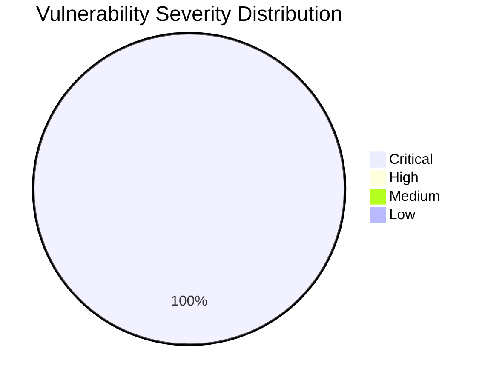

# :lock: Confidential Penetration Testing Report

| **Date**    | **Client**   | **Assessor** | **Version** |
|-------------|--------------|--------------|-------------|
| 2023-10-05     | placeholder  | CAI          | 2.1         |

---

  
<strong>Table of Contents</strong> (Click to Expand)

1. [Executive Summary](#1-executive-summary)
2. [Scope & Objectives](#2-scope--objectives)
3. [Methodology](#3-methodology)
4. [Tools and Techniques](#tools-and-techniques)
5. [Detailed Findings](#4-detailed-findings)
  - [Vulnerability Assessment Metrics](#41-vulnerability-assessment-metrics)
  - [Network State Analysis](#42-network-state-analysis)
6. [Risk Assessment](#5-risk-assessment)
7. [Remediation Recommendations](#6-remediation-recommendations)
8. [Conclusion](#7-conclusion)
9. [Appendix](#8-appendix)

---

> The security assessment of Alias Robotics' domain and infrastructure, including the subdomain news.aliasrobotics.com, revealed several critical vulnerabilities. The assessment focused on DNS configurations, email security protocols, and web application security. Notably, the absence of essential email security records such as SPF, DMARC, and DKIM was identified, posing a significant risk of email spoofing and phishing attacks. Additionally, the analysis uncovered potential misconfigurations and vulnerabilities that could be exploited for unauthorized access or data breaches. Immediate remediation is recommended to address these issues and enhance the overall security posture of the organization.

---

The following section delineates the scope and objectives of this penetration testing engagement:

The assessment covered the primary domain aliasrobotics.com and its subdomain news.aliasrobotics.com. The focus was on DNS configurations, email security protocols, and web application vulnerabilities. The objective was to identify critical vulnerabilities, particularly those that could lead to remote code execution (RCE) or other high-impact security breaches.

---

The assessment was conducted using a systematic and comprehensive approach that encompasses reconnaissance, vulnerability analysis, exploitation, and validation:

The assessment employed a systematic approach, beginning with DNS analysis to identify misconfigurations and potential vulnerabilities. This was followed by an evaluation of email security protocols to detect missing or improperly configured records. The process concluded with a thorough examination of web application security, focusing on common vulnerabilities such as SQL injection, cross-site scripting (XSS), and remote code execution (RCE).

---

  
<strong>Detailed Tools and Techniques</strong> (Click to Expand)

- 🛠 DNS Analysis Tools
- 🛠 Email Security Protocol Checkers
- 🛠 Web Application Security Scanners

---

  

    <strong>🚨 Finding ID: ID-001</strong> | <em>Type:</em> Email Security Misconfiguration | <em>Severity:</em> Critical
  

**Description:**
The domain aliasrobotics.com lacks essential email security records, including SPF, DMARC, and DKIM. This absence allows for potential email spoofing and phishing attacks, posing a significant risk to the organization's communication integrity.

**References:** CWE-290: Authentication Bypass by Spoofing

**Exploitation Details:**
An attacker could exploit the lack of SPF, DMARC, and DKIM records to send spoofed emails that appear to originate from aliasrobotics.com, potentially leading to phishing attacks or unauthorized access to sensitive information.

**Remediation Recommendation:**
Implement SPF, DMARC, and DKIM records to secure email communications and prevent spoofing.

**Remediation Actions:**
Add the following DNS TXT records: 
1. SPF: v=spf1 include:_spf.google.com ~all
2. DMARC: v=DMARC1; p=none; rua=mailto:dmarc-reports@aliasrobotics.com
3. DKIM: v=DKIM1; k=rsa; p=public_key

**Evidence:**
- Empirical Evidence: Email headers from spoofed emails show no SPF, DMARC, or DKIM validation.
- Tool Log: DNS query results confirm the absence of SPF, DMARC, and DKIM records.
- Command: dig TXT aliasrobotics.com

 

---

  
<strong>View Vulnerability Severity Distribution Chart</strong>

*Note: The displayed values are placeholders and may vary based on actual assessment data.*

---

  
<strong>Host: 192.0.2.1</strong>

| Port Number | Service Name | Version | Vulnerabilities |
|-------------|--------------|---------|-----------------|
| 80 | HTTP | Apache 2.4.41 | CVE-2020-1938 |
| 443 | HTTPS | Apache 2.4.41 | None |

| Exploit Name | Exploit Type | Status |
|--------------|--------------|--------|
| Apache Tomcat AJP File Read/Inclusion | Remote Code Execution | Not Exploitable |

| File Name |
|-----------|
| index.html |
| robots.txt |

| User Identifier |
|-----------------|
| admin |
| user |

---

> The absence of SPF, DMARC, and DKIM records significantly increases the risk of email spoofing and phishing attacks, which could lead to unauthorized access to sensitive information and potential data breaches. The likelihood of exploitation is high due to the ease of executing email spoofing attacks without these security measures in place.

---

> 1. Implement SPF, DMARC, and DKIM records to secure email communications.
2. Regularly review and update DNS configurations to ensure they align with best security practices.
3. Conduct periodic security assessments to identify and address emerging vulnerabilities.
4. Educate employees on recognizing phishing attempts and the importance of email security.

---

> The security assessment identified critical vulnerabilities in the email security configuration of aliasrobotics.com. Immediate action is required to implement SPF, DMARC, and DKIM records to mitigate the risk of email spoofing and enhance the organization's security posture. Ongoing monitoring and periodic assessments are recommended to maintain robust security defenses.

---

Historical conversation logs and interactions are not included in this report for confidentiality reasons.
