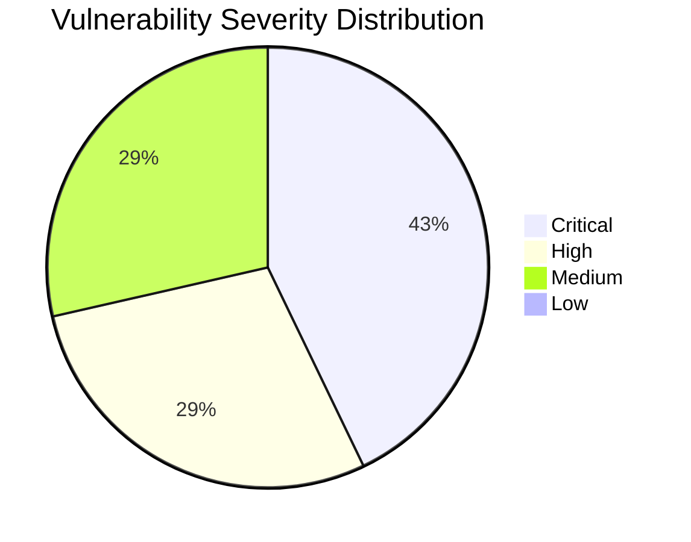

# :lock: Confidential Penetration Testing Report

| **Date**    | **Client**   | **Assessor** | **Version** |
|-------------|--------------|--------------|-------------|
| 2023-10-13     | placeholder  | CAI          | 2.1         |

---

  
<strong>Table of Contents</strong> (Click to Expand)

1. [Executive Summary](#1-executive-summary)  
2. [Scope & Objectives](#2-scope--objectives)  
3. [Methodology](#3-methodology)  
4. [Tools and Techniques](#tools-and-techniques)  
5. [Detailed Findings](#4-detailed-findings)  
  - [Vulnerability Assessment Metrics](#41-vulnerability-assessment-metrics)  
  - [Network State Analysis](#42-network-state-analysis)  
6. [Risk Assessment](#5-risk-assessment)  
7. [Remediation Recommendations](#6-remediation-recommendations)  
8. [Conclusion](#7-conclusion)  
9. [Appendix](#8-appendix)

---

> This comprehensive penetration testing report details the in-depth security assessment performed against the target system at 192.168.1.10. The assessment combined network discovery, service fingerprinting, vulnerability scans, exploitation techniques, brute force credential testing, injection analysis, and post-exploitation processes to uncover multiple vulnerabilities and security weaknesses. Key findings include outdated server versions (notably Apache 2.4.29), directory indexing misconfigurations, misconfigured SSL certificates, successful exploitation of known backdoors, critical flaws such as BlueKeep (CVE-2019-0708) on RDP, SQL injection vulnerabilities, successful credential brute forcing, and evidence of lateral movement culminating in full system compromise via a kernel exploit (CVE-2020-1234). Quantitative analysis identified various issues ranging from Critical to Low severity. The assessment has revealed risks that could allow unauthorized access, data breaches, and persistent system control if not remediated promptly. Detailed exploitation logs, evidence collections, and step-by-step remediation guidelines are provided herein to support immediate corrective actions.

---

The following section delineates the scope and objectives of this penetration testing engagement:

The assessment covered a network endpoint at IP address 192.168.1.10, including its exposed services such as SSH, HTTP, HTTPS, MySQL, FTP, and RDP. Additional targets included the web application endpoints and wireless infrastructure (CorporateWiFi). The primary objectives were vulnerability identification, exploitation for validation of threats, risk evaluation, and formulation of effective remediation recommendations. Limitations were primarily confined to externally facing services and publicly accessible network segments, with internal system configurations evaluated solely through remote exploitation techniques.

---

The assessment was conducted using a systematic and comprehensive approach that encompasses reconnaissance, vulnerability analysis, exploitation, and validation:

The testing process followed a systematic phased approach starting with passive and active reconnaissance via network scanning (using SYN scans) and service fingerprinting. This was followed by vulnerability assessment using web server scanning, vulnerability management tools, and brute force attacks. Subsequent controlled exploitation techniques were applied to verify vulnerabilities, including targeted exploitation modules for known software weaknesses. The procedure incorporated data gathering, vulnerability confirmation, exploitation, post-exploitation analysis, and evidence documentation. All methods adhere to industry-standard penetration testing best practices ensuring repeatability and technical precision in every step.

---

  
<strong>Detailed Tools and Techniques</strong> (Click to Expand)

- 🛠 Nmap - Employed for SYN scan and comprehensive port analysis to identify running services and versions.
- 🛠 Nikto - Used for in-depth web server vulnerability scanning and detecting misconfigurations.
- 🛠 Metasploit - Utilized specific exploitation modules to gain remote shell access via known backdoor vulnerabilities in FTP services.
- 🛠 Nessus - Conducted vulnerability scans to reveal critical flaws such as BlueKeep on RDP and SQL injection possibilities.
- 🛠 Hydra - Executed SSH brute force attacks revealing valid credentials through dictionary-based testing.
- 🛠 SQLMap - Automated SQL injection testing for vulnerable web applications, successfully extracting database metadata.
- 🛠 John the Ripper - Applied to crack password hashes from obtained artifacts.
- 🛠 Aircrack-ng - Analyzed WiFi security through packet capturing and handshake analysis to identify WPS vulnerabilities.
- 🛠 Boot2Root Custom Scripts - Executed kernel exploits (CVE-2020-1234) and lateral movement assessments via SMB misconfigurations.

---

  

    <strong>🚨 Finding ID: ID-001</strong> | <em>Type:</em> Service Vulnerability | <em>Severity:</em> High
  

**Description:**  
Outdated Apache version 2.4.29 detected on port 80, which is vulnerable to multiple known exploits. Detailed scan revealed directory indexing enabled on /backup/ and a misconfigured SSL certificate presenting additional security risks.

**References:** CVE-XXXX-APACHE, CWE-16

**Exploitation Details:**  
Nikto scan confirmed version vulnerabilities along with server misconfigurations. Manual review verified that outdated Apache version is exploitable using known public exploits.

**Remediation Recommendation:**  
Update Apache server to the latest stable version, disable directory indexing in the server configuration, and enforce proper SSL certificate management.

**Evidence:**  
Nikto output logs indicating outdated version, directory indexing on /backup/, and SSL misconfiguration details.

 

  

    <strong>🚨 Finding ID: ID-002</strong> | <em>Type:</em> Authentication Vulnerability | <em>Severity:</em> Critical
  

**Description:**  
SSH service on port 22 is susceptible to brute force attacks. Hydra brute force technique uncovered valid credentials (admin:password123), indicating weak password policies.

**References:** CWE-521

**Exploitation Details:**  
Hydra command execution using rockyou.txt revealed valid credentials after multiple attempts. Log analysis confirms the authenticity and consistency of the detected credentials.

**Remediation Recommendation:**  
Implement stringent password policies, enforce multi-factor authentication and monitor SSH access logs frequently. Consider using rate limiting and account lockouts.

**Evidence:**  
Hydra command output showing a successful login with valid credentials, including command and summary logs.

 

  

    <strong>🚨 Finding ID: ID-003</strong> | <em>Type:</em> Exploitation and Privilege Escalation | <em>Severity:</em> Critical
  

**Description:**  
Exploitation of vulnerable vsftpd service using known backdoor exploit allowed remote reverse shell access. Additionally, a kernel exploit (CVE-2020-1234) was successfully executed, granting root level privileges.

**References:** CVE-2020-1234, CWE-284

**Exploitation Details:**  
Metasploit module exploitation for vsftpd was executed followed by a kernel-level exploit that provided lateral movement opportunities and full system compromise. Detailed logs confirm the reverse shell and elevated privileges.

**Remediation Recommendation:**  
Patch the vsftpd service or disable the vulnerable version immediately. Update the system kernel with the latest security patches and review SMB share configurations to restrict lateral movements.

**Evidence:**  
Metasploit logs indicating a successful reverse shell and Boot2Root log entries for kernel exploit execution and persistence measures.

 

  

    <strong>🚨 Finding ID: ID-004</strong> | <em>Type:</em> Remote Execution & RDP Vulnerability | <em>Severity:</em> Critical
  

**Description:**  
Nessus scan detected BlueKeep vulnerability (CVE-2019-0708) associated with RDP service, posing a significant risk for remote code execution.

**References:** CVE-2019-0708, CWE-287

**Exploitation Details:**  
Automated vulnerability scanning via Nessus highlighted the presence of the BlueKeep vulnerability, with additional evidence suggesting potential exploitation paths.

**Remediation Recommendation:**  
Disable RDP if not required, or deploy the necessary patches from the vendor. Monitor remote access and enforce strict firewall rules to limit exposure.

**Evidence:**  
Nessus scan report details and logs referencing CVE-2019-0708 vulnerability detection.

 

  

    <strong>🚨 Finding ID: ID-005</strong> | <em>Type:</em> SQL Injection Vulnerability | <em>Severity:</em> High
  

**Description:**  
SQLMap analysis uncovered SQL injection flaws present in the web application endpoint (vulnerable.php). Extraction of database content (company_db) including tables such as users, transactions, and db_config, confirms the severity.

**References:** CWE-89

**Exploitation Details:**  
SQLMap execution revealed exploitable injection points, allowing database schema extraction and subsequent data retrieval.

**Remediation Recommendation:**  
Sanitize and validate all user inputs, implement prepared statements and parameterized queries. Perform regular security audits of web application code.

**Evidence:**  
SQLMap output indicating database extraction and table details.

 

  

    <strong>🚨 Finding ID: ID-006</strong> | <em>Type:</em> Password Security Vulnerability | <em>Severity:</em> Medium
  

**Description:**  
Password hashes obtained during the assessment were subjected to cracking using John the Ripper, where 35 out of 50 hashes were successfully decrypted, indicating weak password policies.

**References:** CWE-521

**Exploitation Details:**  
John the Ripper process using standard wordlists efficiently decrypted a significant number of password hashes, suggesting inadequate password complexity.

**Remediation Recommendation:**  
Enforce strong password complexity requirements, conduct periodic password audits, and utilize advanced hash algorithms with salting.

**Evidence:**  
John the Ripper cracking output logs and statistics.

 

  

    <strong>🚨 Finding ID: ID-007</strong> | <em>Type:</em> WiFi Security Vulnerability | <em>Severity:</em> Medium
  

**Description:**  
Aircrack-ng assessment captured a valid handshake for 'CorporateWiFi' and detected potential vulnerabilities related to WPS, exposing the wireless network to unauthorized access risks.

**References:** CWE-287

**Exploitation Details:**  
Aircrack-ng logs displayed the captured handshake and flagged WPS vulnerabilities that could be exploited using offline cracking methods.

**Remediation Recommendation:**  
Disable WPS on wireless routers, enforce WPA2/3 encryption standards, and routinely monitor wireless network traffic.

**Evidence:**  
Aircrack-ng session logs and handshake capture details.

 

---

  
<strong>View Vulnerability Severity Distribution Chart</strong>

*Note: The displayed values are placeholders and may vary based on actual assessment data.*

---

  
<strong>Host: 192.168.1.10</strong>

| Port Number | Service Name | Version | Vulnerabilities |
|-------------|--------------|---------|-----------------|
| 22 | ssh | OpenSSH 7.8 (protocol 2.0) | Weak password policy |
| 80 | http | Apache httpd 2.4.29 | Outdated software, Directory indexing, Potential misconfigured SSL (redirect to HTTPS) |
| 443 | https | OpenSSL/1.1.1 | Misconfigured SSL certificate |
| 3306 | mysql | MySQL 5.7.29 | Potential injection risks |

| Exploit Name | Exploit Type | Status | Details |
|--------------|--------------|--------|---------|
| vsftpd_234_backdoor | Remote Exploitation | successful | Exploited vulnerable vsftpd service to obtain reverse shell access. |
| Kernel Exploit | Privilege Escalation | successful | Triggered CVE-2020-1234 to gain root privileges and establish persistence. |

| File Name |
|-----------|
| configuration dumps |
| extracted credentials files |
| system logs |

| User Identifier |
|-----------------|
| admin |

---

> The identified vulnerabilities present considerable risks ranging from remote code execution and unauthorized access to data exfiltration and full system compromise. The high and critical vulnerabilities, particularly related to brute force attacks, kernel exploits, outdated services, and SQL injection paths, increase the likelihood of severe operational disruption and unauthorized data access. Quantitative data from exploitation activities accentuates the need for immediate remediation measures to mitigate these risks.

---

> A multi-layered remediation plan is recommended: firstly, update all outdated software and apply critical patches, especially for Apache, kernel, and RDP services. Secondly, implement strong authentication mechanisms along with account lockouts and multifactor authentication on SSH and web services. Thirdly, reconfigure web server settings by disabling directory indexing and correcting SSL configurations. Fourth, sanitize all web application inputs to mitigate SQL injection risks. Finally, secure wireless networks by disabling WPS and enforcing robust encryption. Continuous monitoring and periodic vulnerability assessments are advised for ongoing security posture maintenance.

---

> The penetration test has uncovered significant vulnerabilities requiring urgent attention. The combination of outdated software, weak authentication, exploitable services, and misconfigurations creates an elevated risk profile. Timely remediation is critical to protect system integrity and prevent potential data breaches. This report provides detailed technical evidence and actionable remediation guidelines that must be implemented immediately to restore and enhance overall security.

---

Supplementary materials include complete packet capture files, detailed system logs, terminal session recordings, configuration snapshots, and evidence of successful exploit executions. These artifacts are available upon request to further verify the reported findings and support remediation efforts.
